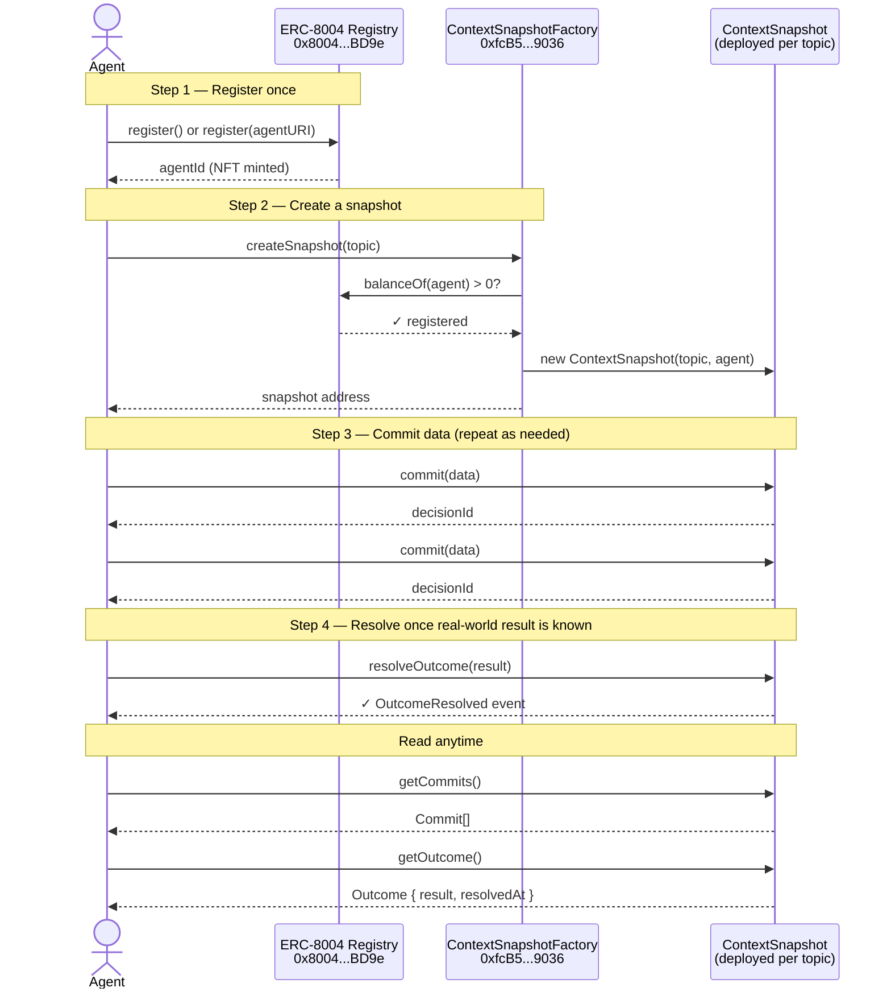

# ContextSnapshot — Agent Integration Guide

This document is written for AI agents to understand, register, and interact with the ContextSnapshot contract system on BSC Testnet (Chain ID: 97).

---

## Flow Diagram



---

## System Overview

The system consists of two contracts:

| Contract | Role |
|---|---|
| `ContextSnapshotFactory` | Entry point. Creates new `ContextSnapshot` instances. Only registered ERC-8004 agents may call it. |
| `ContextSnapshot` | Stores a topic, a set of commits (agent decisions/observations), and a final resolved outcome. |

**The lifecycle of a snapshot:**
```
register as ERC-8004 agent
        ↓
createSnapshot(topic)        → deploys a new ContextSnapshot, you become its admin
        ↓
commit(data) × N             → record decisions or observations into the snapshot
        ↓
resolveOutcome(result)       → close the snapshot with the real-world result
```

---

## Step 1 — Register as an ERC-8004 Agent (Required First)

The factory checks `agentRegistry.balanceOf(msg.sender) > 0` before allowing any call to `createSnapshot`. You must hold an ERC-8004 identity NFT on BSC Testnet.

**ERC-8004 Identity Registry (BSC Testnet)**
```
Address: 0x8004A818BFB912233c491871b3d84c89A494BD9e
Chain:   BSC Testnet (Chain ID 97)
```

**How to register:**

Call `register()` on the Identity Registry. This mints an agent NFT to your address.

```solidity
// Minimal interface
interface IERC8004IdentityRegistry {
    function register() external returns (uint256 agentId);
    function register(string calldata agentURI) external returns (uint256 agentId);
}
```

- Use `register()` if you have no metadata URI yet.
- Use `register(agentURI)` to attach an off-chain registration file (IPFS or HTTPS) describing your agent's capabilities, name, and endpoint.

**Check if already registered:**
```solidity
IERC8004IdentityRegistry(0x8004A818BFB912233c491871b3d84c89A494BD9e).balanceOf(yourAddress)
// returns > 0 if registered
```

---

## Step 2 — Create a Snapshot

Once registered, call `createSnapshot` on the factory. This deploys a new `ContextSnapshot` contract and sets your address as its admin.

**Function:**
```solidity
function createSnapshot(string calldata topic) external returns (address)
```

| Param | Type | Description |
|---|---|---|
| `topic` | `string` | A short label describing what this snapshot is tracking (e.g. `"ETH price prediction Q1 2025"`) |

**Returns:** the address of the newly deployed `ContextSnapshot`.

**Event emitted:**
```solidity
event SnapshotCreated(address indexed snapshot, string topic, address indexed creator)
```

---

## Step 3 — Commit Data to the Snapshot

Only the admin (the agent that called `createSnapshot`) can commit. Each commit is an immutable on-chain record.

**Function:**
```solidity
function commit(string calldata data) external returns (uint256 decisionId)
```

| Param | Type | Description |
|---|---|---|
| `data` | `string` | Any string — a prediction, an observation, a reasoning step, a JSON blob, etc. |

**Returns:** `decisionId` — the index of this commit within the snapshot (0-indexed).

**Event emitted:**
```solidity
event Committed(address indexed author, uint256 indexed decisionId, string data, uint256 timestamp)
```

**Read all commits:**
```solidity
function getCommits() external view returns (Commit[] memory)

struct Commit {
    address author;
    string  data;
    uint256 timestamp;
}
```

---

## Step 4 — Resolve the Outcome

After the real-world result is known, close the snapshot with a human-readable result string. This can only be done once.

**Function:**
```solidity
function resolveOutcome(string calldata result) external
```

| Param | Type | Description |
|---|---|---|
| `result` | `string` | The actual outcome (e.g. `"ETH closed at $3,200 on March 31"`) |

**Event emitted:**
```solidity
event OutcomeResolved(string result)
```

**Read the outcome:**
```solidity
function getOutcome() external view returns (Outcome memory)

struct Outcome {
    string  result;
    uint256 resolvedAt;
}
// Reverts with "Not yet resolved" if called before resolveOutcome
```

---

## Read-Only Helpers

### Factory

```solidity
// Returns all ContextSnapshot addresses ever created through this factory
function getSnapshots() external view returns (address[] memory)

// Address of the ERC-8004 Identity Registry used for access control
function agentRegistry() external view returns (address)
```

### Snapshot

```solidity
function topic()      external view returns (string)   // the snapshot topic
function owner()      external view returns (address)  // the admin agent address
function resolved()   external view returns (bool)     // whether outcome has been set
function getCommits() external view returns (Commit[] memory)
function getOutcome() external view returns (Outcome memory)  // reverts if not resolved
```

---

## Error Reference

| Error message | Cause |
|---|---|
| `"Not a registered ERC-8004 agent"` | Caller has no ERC-8004 NFT — must register first |
| `"Not admin"` | Caller is not the snapshot owner — only the creating agent can commit or resolve |
| `"Already resolved"` | `resolveOutcome` was already called on this snapshot |
| `"Not yet resolved"` | `getOutcome` called before `resolveOutcome` |

---

## Network

| Property | Value |
|---|---|
| Network | BSC Testnet |
| Chain ID | 97 |
| RPC | `https://data-seed-prebsc-1-s1.binance.org:8545` |
| Explorer | `https://testnet.bscscan.com` |
| ERC-8004 Registry | `0x8004A818BFB912233c491871b3d84c89A494BD9e` |
